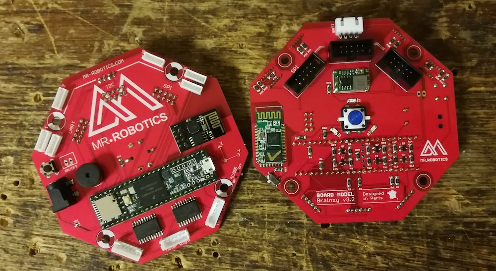
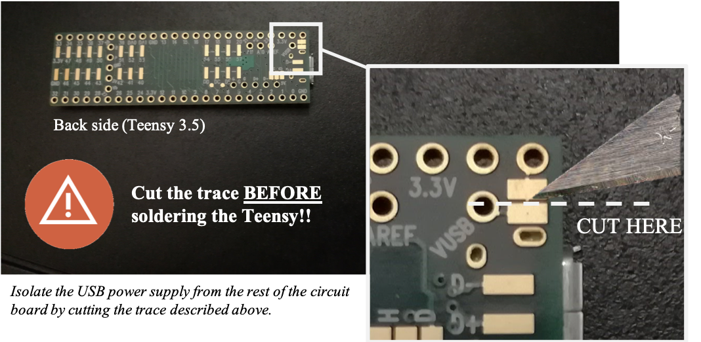

# Brainzy Board

Il s'agit d'une alternative aux cartes Arduino pour facilement construire son propre robot différentiel ou omnidirectionel. Basé sur une [Teensy 3.5](https://www.pjrc.com/store/teensy35.html), la Brainzy board se programme en C++ à travers l'[IDE Arduino](https://www.arduino.cc/en/Main/Software) à l'aide de la [bibliothèque Brainzy](https://github.com/WhoIsMrRobotics/brainzy-library). De nombreux modules peuvent être ajoutés à la carte pour étendre la complexité de vos créations.

Il existe deux types de modules :
* Les *Widgets*, dont la connection se fait par des connecteurs magnétiques et la communication via un bus I2C ;
* Les *extensions*, dont la connection se fait par des connecteurs standards et la communication via des bus SPI, UART, et/ou I2C.

Pour plus d'information, consultez notre site [www.mr-robotics.com](https://www.mr-robotics.com/).

**Caractéristiques de la Brainzy Board**

* *Mode d'utilisation :* 2 choix possibles pour le déplacement du robot : entrainement différenciel (2 roues) ou entrainement omnidirectionel (3 roues)
* *Dimensions de la carte :* 100mm x 100mm (forme hexagonale)
* *Moyens de communication :* USB, Bluetooth et Wifi

**Ports Entrées/Sorties**

* 1 port micro-USB
* 8 ports I2C, 3 ports SPI, 2 ports UART
* 3 ports pour des moteurs DC dotés de codeurs incrémentaux (deux channels)
* 1 lecteur de carte nano-SD
* 1 port pour vérifier l'état de charge de la batterie (jusqu'à 3 cellules)
* 1 Buzzer
* 1 interrupteur programmable
* 2 LEDs programmables

**Modules intégrés**

* 1 Module bluetooth (HC-05)
* 1 Module Wifi (ESP8266-01)

**Exemples de Widgets associés**

* IMU : accéléromètre 3 axes + gyroscope 3 axes (MPU-6050)
* Système d'éclairage : NeoPixels (WS2812B)
* Télémètre à ultrasons : Sonar (HC-SR04)
* Télémètre infrarouge : Sharp (GP2Y0A41SK0F)
* ...

**Exemples d'extensions associées**

* Bras poly-articulé
* Système de webcam pilotée
* Télécomande bluetooth
* Écran tactile
* ...

## Comment l'obtenir ?

Vous pouvez la commander directement sur notre site [shop.mr-robotics.com](https://shop.mr-robotics.com/) ou suivre les étapes suivantes :
1. Réalisez le PCB à l'aide des fichiers GERBER.
2. Commandez les composants répertoriés dans le fichier BOM, puis soudez les.
3. Soudez une Teensy 3.5 en faisant attention aux indications suivantes.

## Quelques tutoriels

* Pour obtenir un modèle CAO de la carte, consultez [ce lien](https://www.youtube.com/watch?v=ekHAkWB-WTM).
* Pour générer les fichiers Gerber nécessaire à la production du PCB, consultez [ce lien](https://learn.sparkfun.com/tutorials/designing-pcbs-advanced-smd/gerber-generation).
